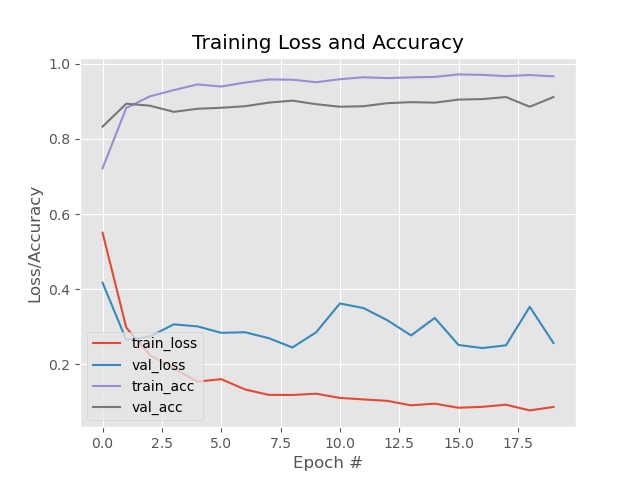

# Face Mask Detection Using 

This project implements a face mask detection system using a Convolutional Neural Network (CNN) built on the MobileNetV2 architecture. The model can classify whether a person is wearing a face mask or not, and it also provides real-time detection through a webcam.

## Table of Contents
- [Introduction](#introduction)
- [Project Structure](#project-structure)
- [Requirements](#requirements)
- [Dataset](#dataset)
- [Training](#training)
- [Real-Time Mask Detection](#real-time-mask-detection)
- [Results](#results)
- [References](#references)

## Introduction

The project involves two main components:
1. **Training a model** that can classify images as `with_mask` or `without_mask`.
2. **Real-time detection** using OpenCV to identify people wearing or not wearing a face mask in video streams.

## Project Structure

```bash
Face-Mask-Detection/
│
├── dataset/                         # Dataset folder (place the images here)
│   ├── with_mask/                   # Images of people wearing masks
│   └── without_mask/                # Images of people not wearing masks
│
├── face_detector/                   # Face detection model files (deploy.prototxt, res10_300x300_ssd_iter_140000.caffemodel)
│
├── train_mask_detector.py           # Python script to train the face mask detector
├── detect_mask_video.py             # Python script for real-time mask detection via webcam
├── mask_detector.h5                 # Saved Keras model after training
├── plot.png                         # Training loss and accuracy plot
├── README.md                        # Project README
└── requirements.txt                 # Python dependencies for the project
```

## Requirements

To install the required Python packages, run the following command:

```bash
pip install -r requirements.txt
```

### Dependencies
- `tensorflow`
- `keras`
- `numpy`
- `opencv-python`
- `imutils`
- `scikit-learn`
- `matplotlib`

## Dataset

The dataset consists of two directories:
- `with_mask`: Images of individuals wearing face masks.
- `without_mask`: Images of individuals not wearing face masks.

Place the dataset images in the `dataset/` directory, ensuring the images are divided into the two categories as mentioned above.


## Training


IMPORTANT REMINDER
before training the model open train_mask_detector.py and change the path of the datasets as your local folder 

To train the face mask detector, simply run the following command:

```bash
python train_mask_detector.py
```

This script:
1. Loads and preprocesses the dataset images.
2. Trains the model using the MobileNetV2 architecture.
3. Evaluates the model on the test set.
4. Saves the trained model as `mask_detector.h5`.
5. Plots and saves the training loss and accuracy graph.

### Model Hyperparameters
- Initial Learning Rate: `1e-4`
- Batch Size: `32`
- Epochs: `20`

The training loss and accuracy will be saved in `plot.png` after training.

## Real-Time Mask Detection

Once the model is trained, you can perform real-time face mask detection using your webcam. To start the video stream and detect face masks in real time, run the following command:

```bash
python detect_mask_video.py
```

This script:
1. Loads the face detector model and the trained mask detector model.
2. Uses OpenCV to capture video frames.
3. Detects faces and classifies whether each face is wearing a mask or not.
4. Draws a bounding box around the face and displays the label (`Mask` or `No Mask`) with the confidence score.

### Keyboard Control
- Press `q` to quit the video stream.

## Results

The training loss and accuracy over the epochs are plotted and saved as `plot.png`:



The model is saved as `mask_detector.h5`, and the real-time detection will label faces in the video stream with `Mask` or `No Mask`.

## References

This project is based on the implementation of MobileNetV2 for transfer learning. You can refer to the following resources for more details:
- [MobileNetV2](https://keras.io/api/applications/mobilenet/)
- [OpenCV DNN Module](https://docs.opencv.org/master/d6/d0f/group__dnn.html)

---
